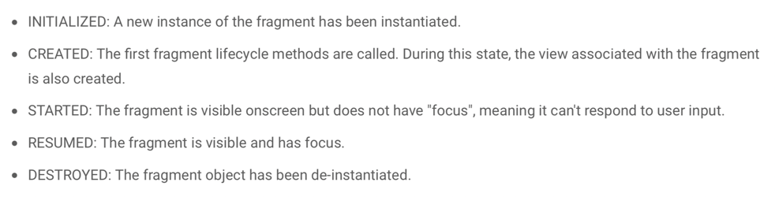
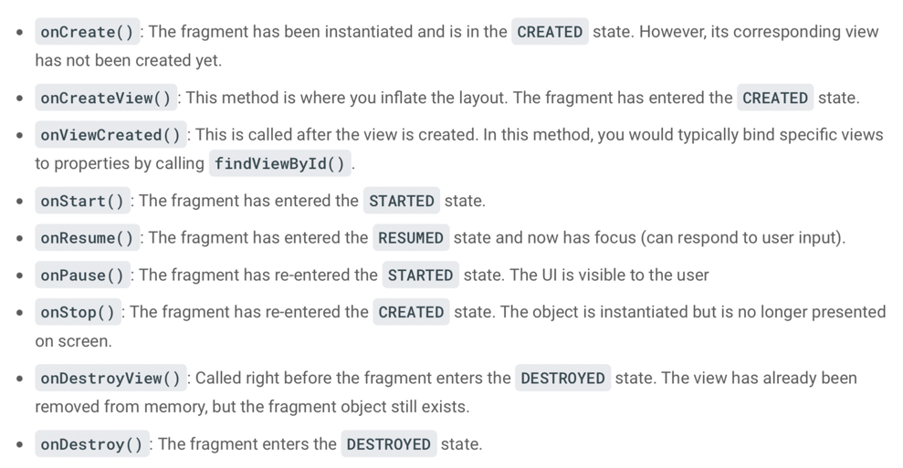
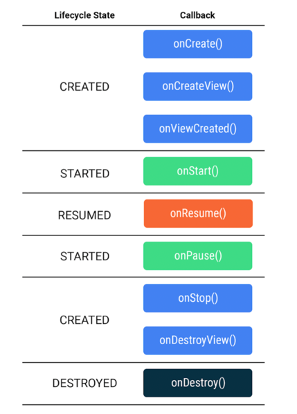

# Wordy

A basic android app helps learning about Fragments and the Navigation Component

A fragment is simply a reusable piece of your app's user interface. Like activities, 
fragments have a lifecycle and can respond to user input. A fragment is always contained 
within the view hierarchy of an activity when it is shown onscreen. Due to their emphasis on 
reusability and modularity, it's even possible for multiple fragments to be hosted simultaneously 
by a single activity. Each fragment manages its own separate lifecycle.

## Fragment Lifecycle

## Fragment class provides many methods that can be override to respond to lifecylce events

